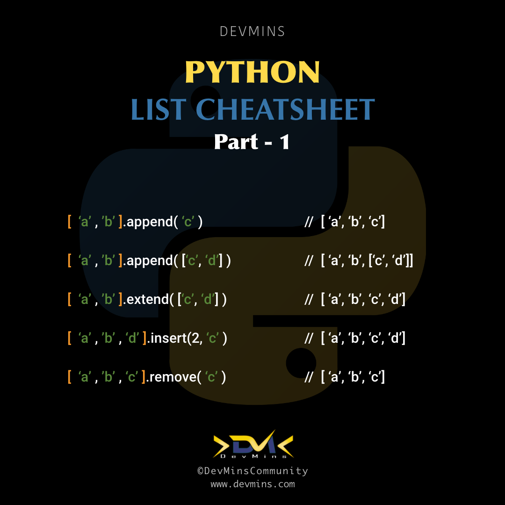
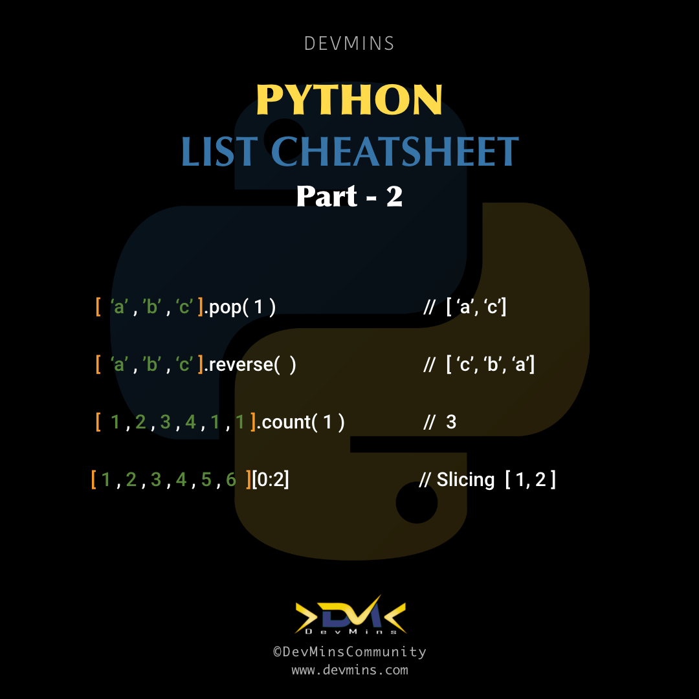
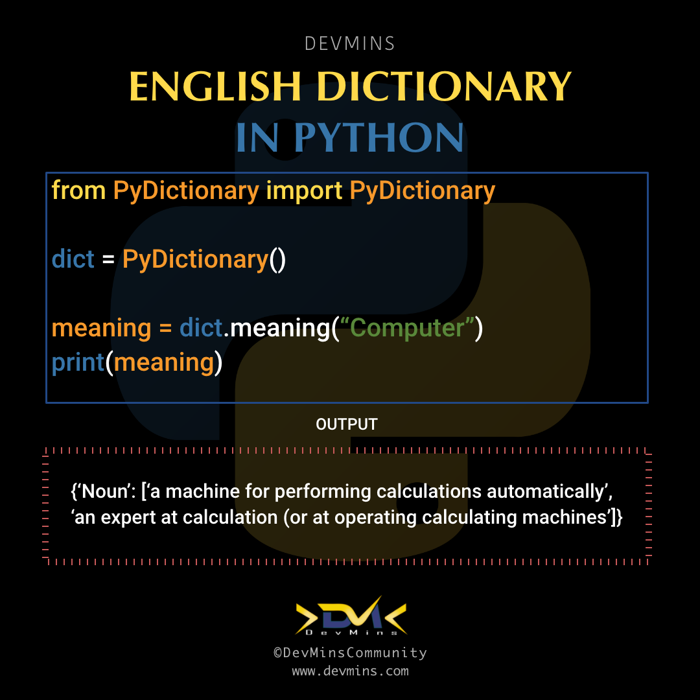
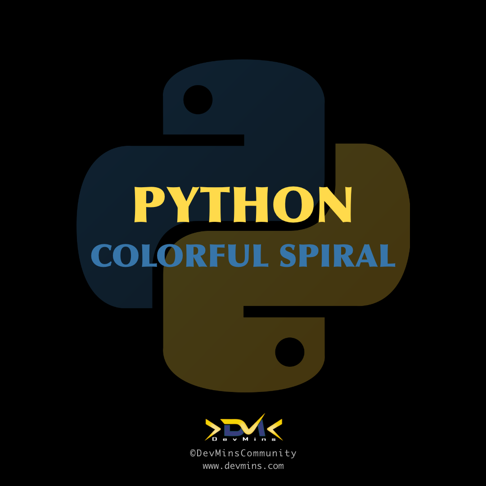
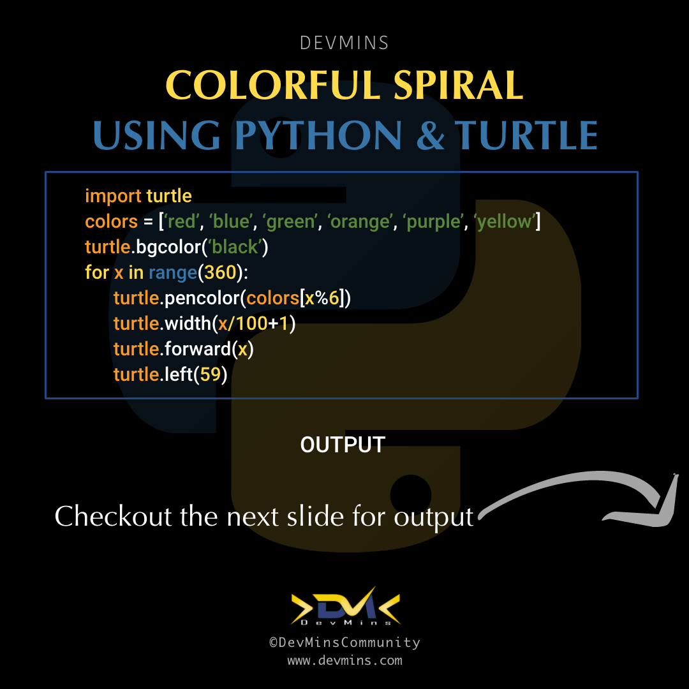
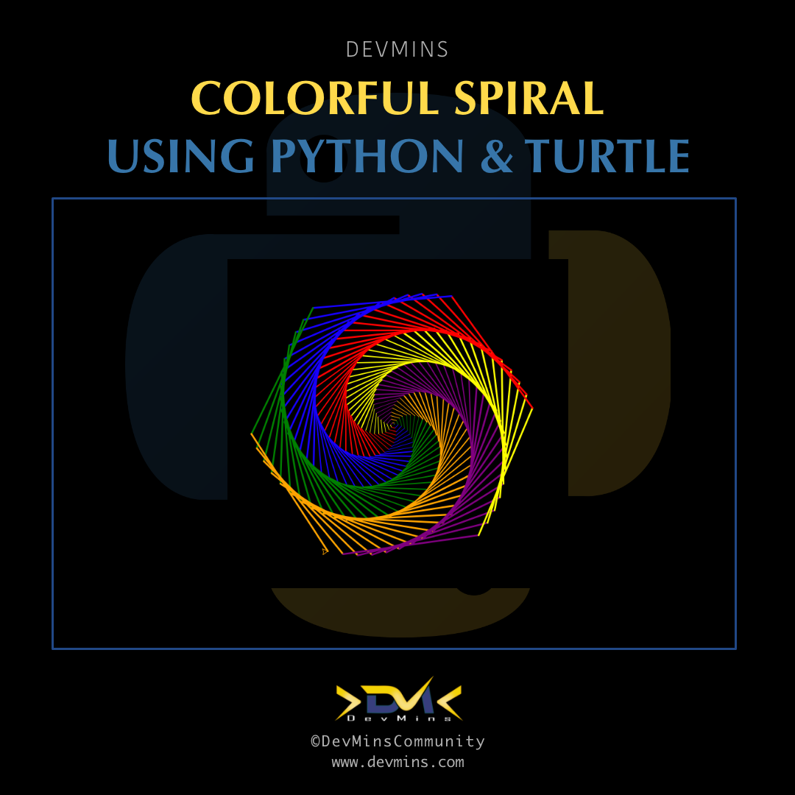
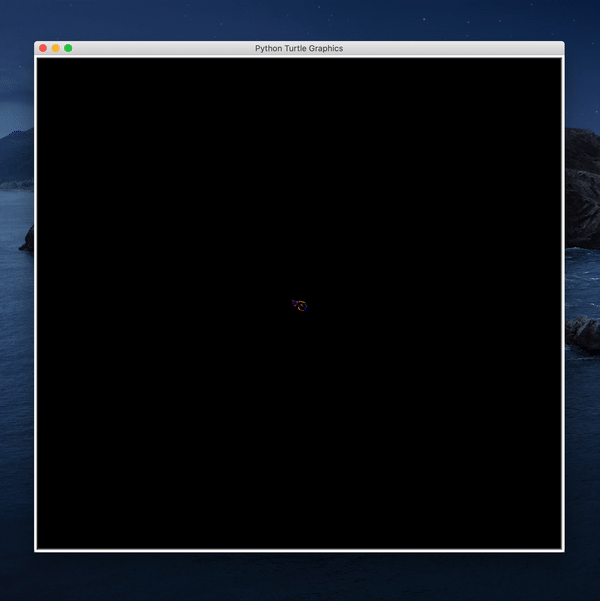
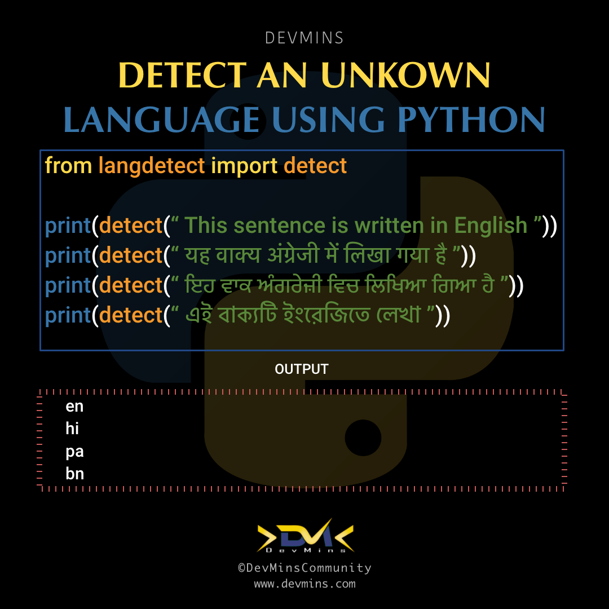

# python-practice-code

- english-dictionary-python.py
- color_spiral.py

## Social Media Posts

 <h3> - Python List </h3>
 
 | 1| 2| 3|
 |------|-------|-------|
 ||||
 
 
 <h3> - English Dictionary </h3>
 
 | 1| 2|
 |------|-------|
 |||
 
 
 <h3> - Colorful Spiral </h3>
 
 | 1| 2|
 |------|-------|
 |||
 
 | 3| 4|
 |------|-------|
 |||
 
 
 <h3> - Language Detection </h3>
 
 | 1| 2|
 |------|-------|
 |||
